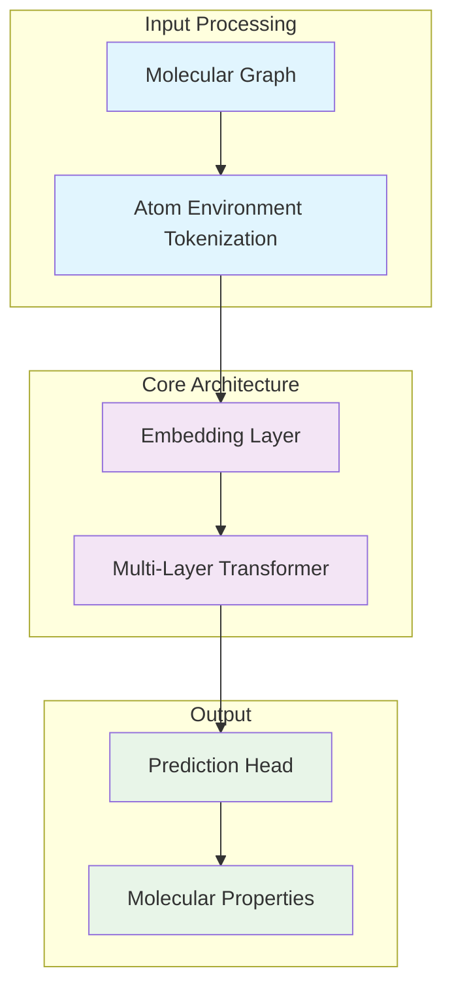
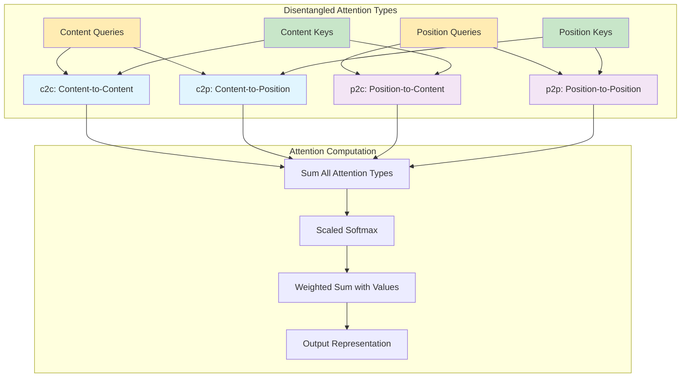
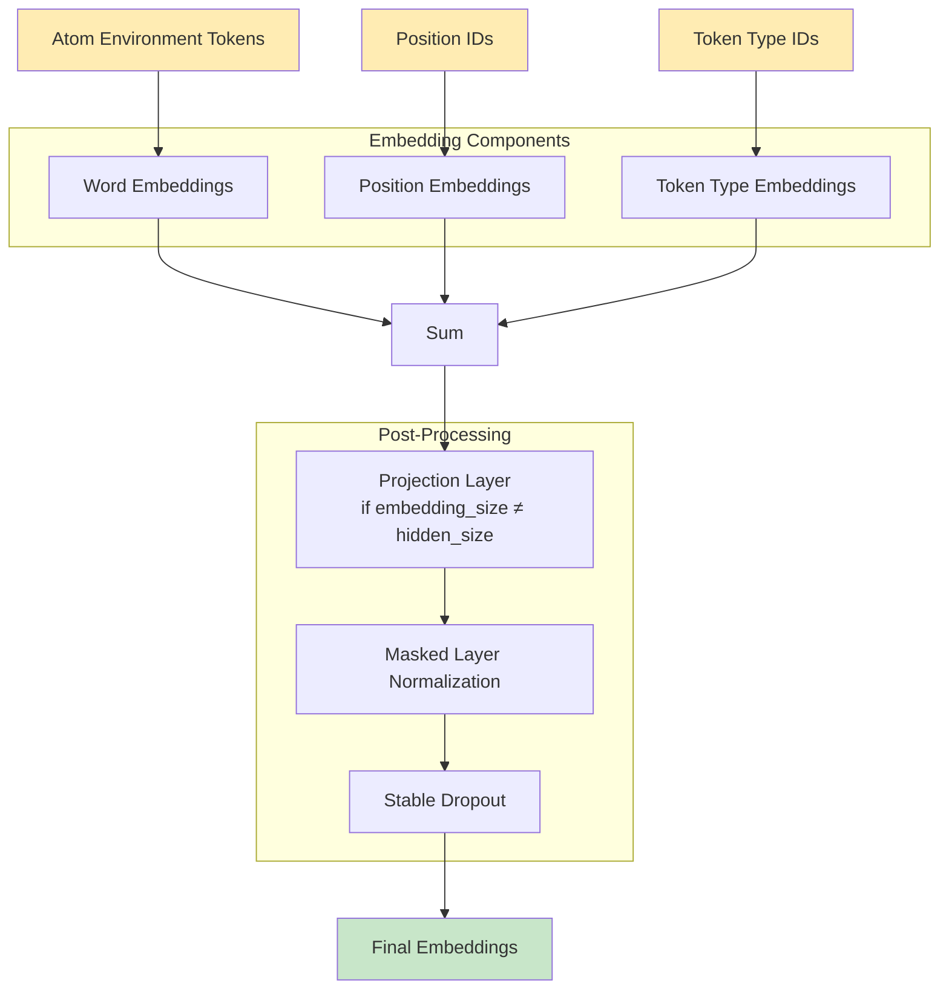
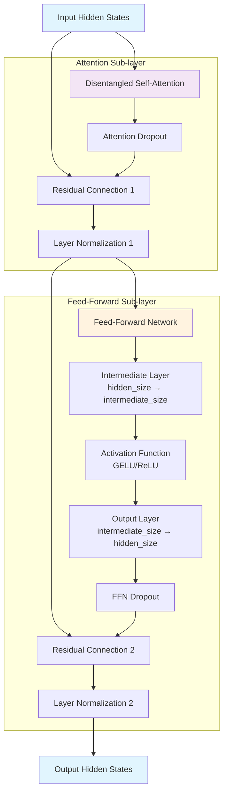
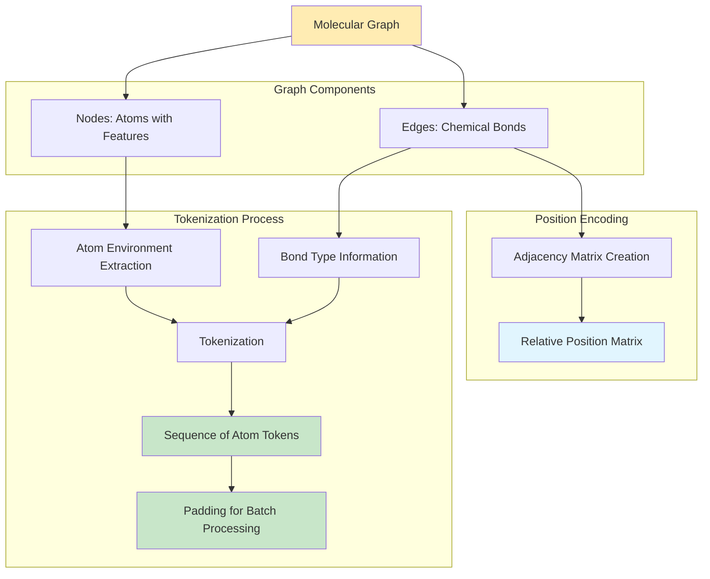
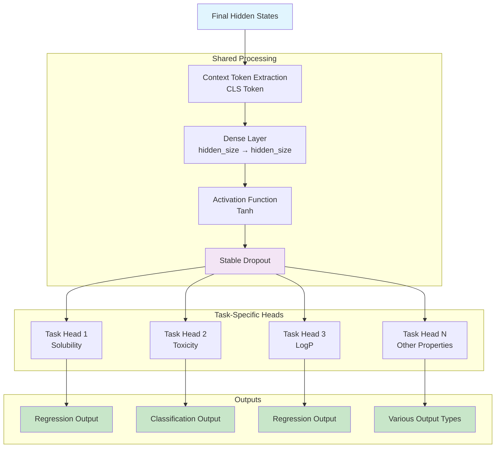
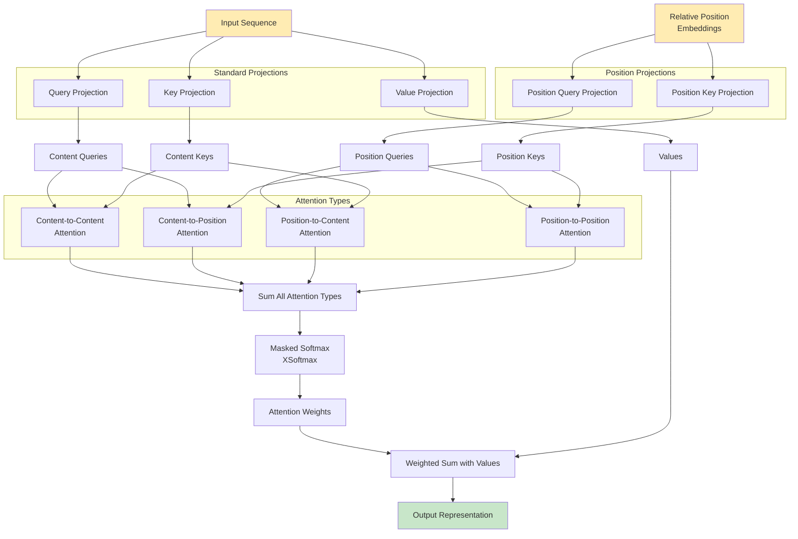
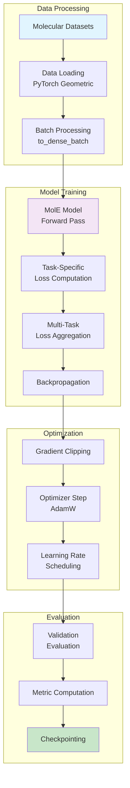
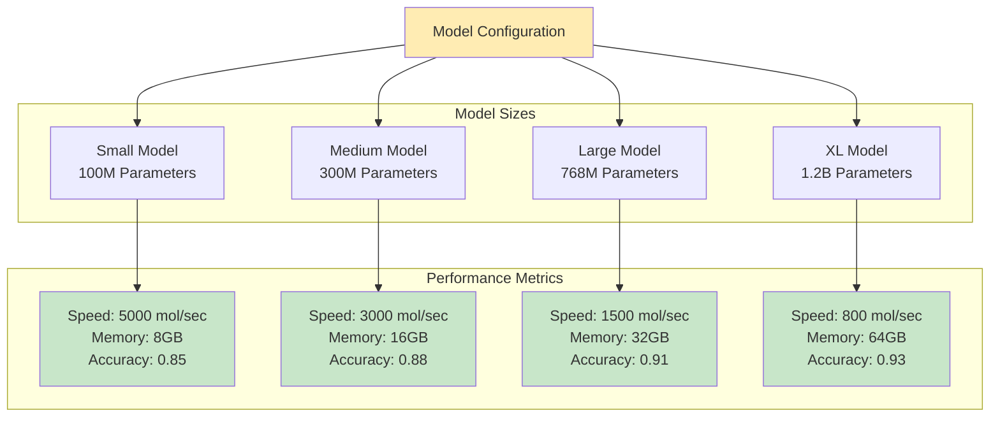

# MolE Presentation Diagrams

This file contains all the Mermaid diagram code for the MolE presentation. You can use these diagrams to generate visual elements for your slides.

## Diagram 1: High-Level Architecture Flow

**Usage:** Overview slide showing the complete MolE pipeline from molecular input to property predictions.

---

## Diagram 2: Disentangled Attention Types

**Usage:** Detailed explanation of the four types of disentangled attention and how they combine.

---

## Diagram 3: Embedding Layer Architecture

**Usage:** Detailed view of how molecular tokens are converted to dense embeddings.

---

## Diagram 4: Transformer Layer Structure

**Usage:** Internal structure of a single transformer layer showing attention and feed-forward components.

---

## Diagram 5: Molecular Graph to Sequence Conversion

**Usage:** How molecular graphs are converted to transformer-compatible sequences.

---

## Diagram 6: Multi-Task Prediction Architecture

**Usage:** Multi-task prediction architecture showing how different molecular properties are predicted.

---

## Diagram 7: Attention Mechanism Detail

**Usage:** Detailed breakdown of the disentangled attention mechanism showing all components.

---

## Diagram 8: Training Pipeline

**Usage:** Complete training pipeline showing data processing, model training, and evaluation.

---

## Diagram 9: Model Scalability

**Usage:** Model scalability showing performance trade-offs for different model sizes.

---

## How to Use These Diagrams

### 1. **Online Mermaid Editors**
- [Mermaid Live Editor](https://mermaid.live/)
- [Mermaid Chart](https://www.mermaidchart.com/)
- Copy and paste the code to generate SVG/PNG images

### 2. **Local Generation**
- Install Mermaid CLI: `npm install -g @mermaid-js/mermaid-cli`
- Save diagram code to `.mmd` files
- Generate images: `mmdc -i diagram.mmd -o diagram.png`

### 3. **Integration with Presentation Tools**
- Generate high-resolution PNG or SVG files
- Import into PowerPoint, Google Slides, or Keynote
- Maintain consistent styling with presentation theme

### 4. **Customization**
- Modify colors to match your presentation theme
- Adjust node sizes and text for readability
- Add or remove elements based on audience needs

## Color Scheme Reference

- **Light Blue (#e1f5fe)**: Input/Output components
- **Light Purple (#f3e5f5)**: Processing components
- **Light Green (#c8e6c9)**: Final outputs
- **Light Orange (#ffecb3)**: Configuration/Setup
- **Light Yellow (#fff3e0)**: Intermediate processing

These diagrams provide comprehensive visual support for your MolE presentation, covering all major architectural components and processes.